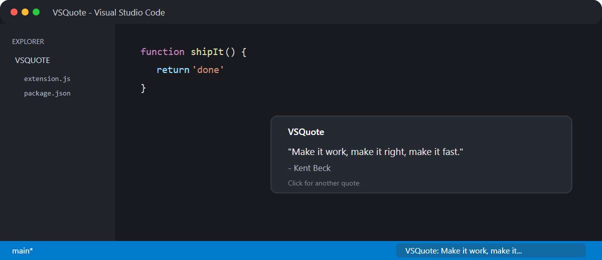
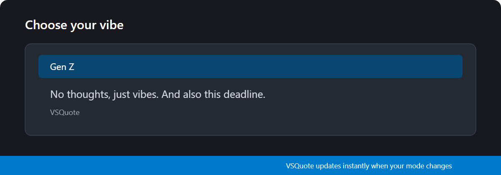
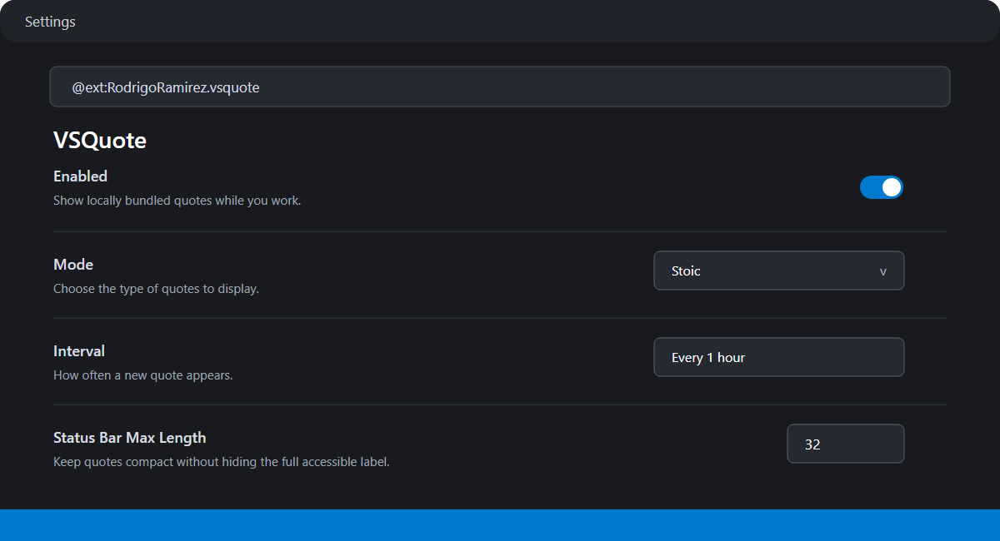

# VSQuote - Unhinged Quotes for Your Coding Sessions


VSQuote is a VS Code extension that delivers quotes straight to your status bar while you code. Whether you need chaotic Gen Z energy, stoic wisdom, aggressive hype, or existential philosophy, VSQuote has a mode for your mood.



## Features

- **Compact Status Bar Quotes:** Choose how much text appears while the full quote remains available in the tooltip and accessible label.
- **Multiple Modes:** Choose your vibe: Gen Z, Funny, Hype, Inspirational, Stoic, Philosophical, Affirmations, or all of them at once.
- **Configurable Interval:** Get a new quote every 30 min, 1 hour, 2 hours, or up to 24 hours.
- **No Immediate Repeats:** Recently displayed quotes are skipped automatically.
- **Favorites and History:** Save favorites across sessions or revisit the last 20 quotes from the current session.
- **Copy Anywhere:** Copy the current quote, or select one from favorites or history.
- **First-Run Vibe Picker:** Choose a starting mode or dismiss it and keep the default.
- **Offline:** All 1000+ quotes are bundled locally. No internet needed.



## Modes

| Mode | Vibe |
|------|------|
| 🧠 Gen Z | Unhinged, chaotic, terminally online dev humor |
| 😂 Funny | Standup comedy and TV show quotes |
| 🔥 Hype | An unhinged soccer coach screaming at you to SHIP THE CODE |
| 💡 Inspirational | Classic motivational quotes |
| 🏛️ Stoic | Marcus Aurelius, Seneca, Epictetus |
| 🤔 Philosophical | Thought experiments and big questions |
| 💛 Affirmations | Gentle positive self-talk |
| 🎲 All | Random mix of everything |

## Settings

Open Settings (`Ctrl+,`) and search "VSQuote":

- **Mode** — Choose your quote category (default: Gen Z)
- **Interval** — How often quotes rotate (default: every hour)
- **Status Bar Max Length** — Show 12–80 characters (default: 32)
- **Enabled** — Toggle quotes on/off without uninstalling



### How to Change Settings

1. Open the Command Palette (`Ctrl+Shift+P`)
2. Type `Preferences: Open Settings (UI)`
3. Search for `VSQuote`
4. Pick your mode, interval, or flip the enable switch

Or add these directly to your `settings.json`:

```json
{
  "vsquote.mode": "genz",
  "vsquote.interval": "60",
  "vsquote.statusBarMaxLength": 32,
  "vsquote.enabled": true
}
```

## Commands

Open the Command Palette and search for **VSQuote**:

| Command | What it does |
|---|---|
| **VSQuote: Get Quote** | Shows another non-repeating quote |
| **VSQuote: Copy Current Quote** | Copies the current quote and attribution |
| **VSQuote: Favorite or Unfavorite Current Quote** | Toggles the current favorite |
| **VSQuote: Show Favorites** | Selects and copies a saved favorite |
| **VSQuote: Show Quote History** | Selects and copies a recent session quote |
| **VSQuote: Choose Vibe** | Changes the active quote mode |

## Installation

Install from the [VS Code Marketplace](https://marketplace.visualstudio.com/items?itemName=RodrigoRamirez.vsquote)

## Privacy and license

VSQuote is free, runs offline, and collects no telemetry. It never reads or
writes workspace files. Recent history stays in memory; favorites and the
first-run flag use VS Code extension global state. See the full
[privacy statement](PRIVACY.md).

The extension software and VSQuote-authored material are available under the
[MIT License](LICENSE). Third-party quotations retain their respective rights;
see the [quote corpus policy](quotes/README.md).

## Development and releases

VSQuote requires Node.js 20.19 or newer for local tooling:

```bash
npm install
npm test
npm run inspect:package
npm run package
```

Pull requests and pushes to `main` run linting, JavaScript type checking,
extension-host tests, quote-corpus validation, version checks, and VSIX
packaging. The packaged extension is uploaded as a workflow artifact.

Marketplace releases are tag-driven. Update the version in `package.json` and
`package-lock.json`, add the matching `CHANGELOG.md` heading, then push a tag
such as `v3.0.1`. The `marketplace` GitHub environment must contain a
`VSCE_PAT` secret authorized for the `RodrigoRamirez` Marketplace publisher.
The workflow rejects tags that do not match the package version and publishes
the exact VSIX it validated.

## Release Notes

### 3.0.0
- Replaced external API with 1000+ local curated quotes
- Added 7 quote modes (Gen Z, Funny, Hype, Stoic, Philosophical, Affirmations, Inspirational)
- Status bar integration — quotes rotate without popups
- Configurable interval
- Quote on startup
- "Another" button for instant new quotes

### 2.0.0
- Updated logo and README

### 1.0.0
- Initial release

Made with 🦔 by [@TheRoro](https://github.com/TheRoro)
